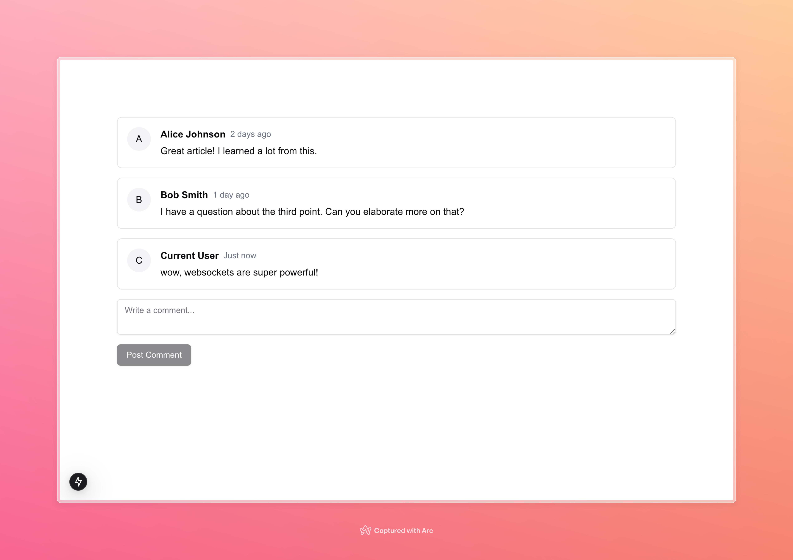

This is a companion project for a public blog post available [here](https://blog.mechanicalrock.io/2024/11/04/appsync-events.html)

Built using a [Next.js](https://nextjs.org) project bootstrapped with [`create-next-app`](https://nextjs.org/docs/app/api-reference/cli/create-next-app).

## Getting Started

Follow along with the blog post, and input your AWS AppSync Events Environment info (realtime domain, http domain, & api key)
Then, run the development server:

```bash
bun dev
```

Open [http://localhost:3000](http://localhost:3000) with your browser to see a list of comments, open another private browser session to see them update in real time over websockets.


